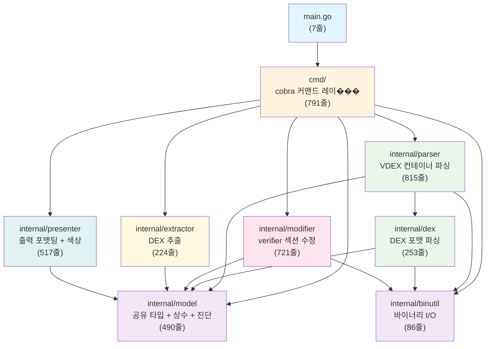
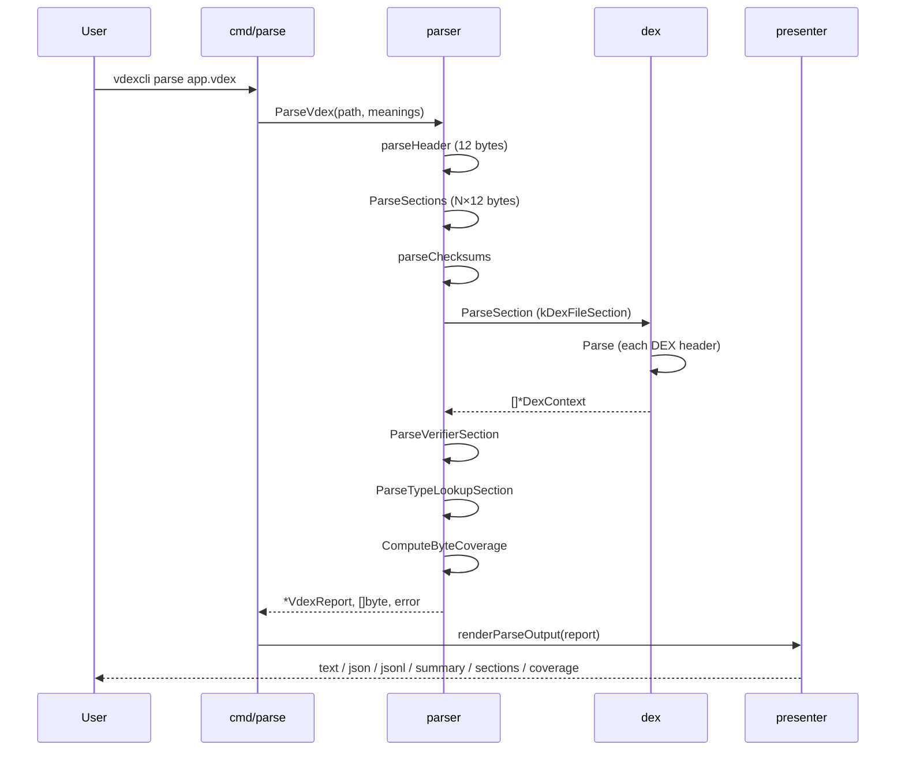
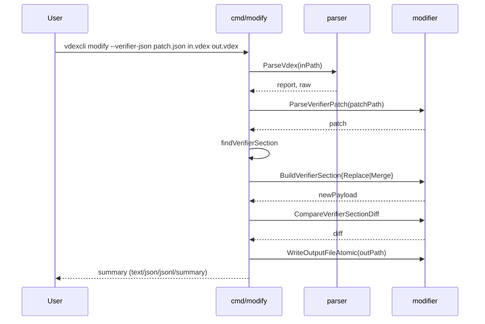
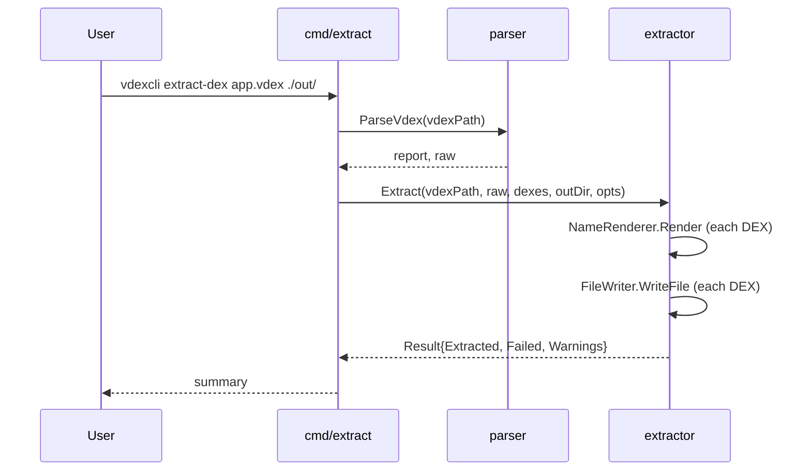

# vdexcli 아키텍처

이 문서는 vdexcli의 패키지 구조, 의존 관계, 데이터 흐름을 설명합니다.

## 설계 원칙

- **SRP**: 각 패키지와 파일은 하나의 책임만 가진다.
- **DIP**: cmd 레이어는 internal 패키지의 exported 함수/인터페이스에만 의존한다.
- **ISP**: extractor 패키지는 FileWriter, NameRenderer, DexExtractor 3개의 작은 인터페이스로 분리되어 있다.
- **순환 없음**: 모든 의존은 단방향이며, `go vet`으로 검증된다.

## 패키지 의존 그래프



## 레이어 구분

```
┌─────────────────────────────────────────────────────────┐
│  main.go (7줄) — Entry point                            │
├─────────────────────────────────────────────────────────┤
│  cmd/ — CLI 레이어 (cobra 커맨드, 플래그, 입력 검증)     │
│  root.go · parse.go · extract.go · modify.go            │
│  dump.go · version.go                                   │
├─────────────────────────────────────────────────────────┤
│  비즈니스 로직                                           │
│  ┌────────┐ ┌──────────┐ ┌───────────┐ ┌──────────┐    │
│  │ parser │ │ modifier │ │ extractor │ │presenter │    │
│  │  VDEX  │ │ verifier │ │    DEX    │ │  출력    │    │
│  │  파싱  │ │   수정   │ │   추출   │ │  포맷    │    │
│  └���──┬────┘ └────┬─────┘ └─────┬─────┘ └────┬─────┘    │
│      │           │             │             │          │
│      ▼           │             │             │          │
│  ┌─��──────┐      │             │             │          │
│  │  dex   │      │             │             │          │
│  │  DEX   │      │             │             │          │
│  │  파싱  │      │             │             │          │
│  └───┬────┘      │             │             │          │
├────��─┼───────────┼─────────────┼─────────────┼──────────┤
│  기반 레이어                                             │
│  ┌──────────────────┐  ┌───────────────────────────┐    │
│  │     binutil      │  │          model            │    │
│  │ ReadU32, LEB128  │  │ 타입, 상수, ParseDiagnostic│    │
│  │ Align4, ...      │  │ 29 types, 33 diag codes   │    │
│  └──────────────────┘  └───────────────────────────┘    │
└─────────────────────────────────────────────────────────┘
```

## 패키지 상세

### main.go (7줄)

진입점. `cmd.Execute()`만 호출한다.

### cmd/ (777줄, 6 파일)

cobra 커맨드 정의와 플래그 바인딩만 담당. 비즈니스 로직은 internal 패키지에 위임.

| 파일 | 줄 | 역할 |
|------|---:|------|
| root.go | 115 | 루트 커맨드, 전역 플래그, `resolvedFormat()`, `resolveInputPath()` |
| parse.go | 134 | `parse` 서브커맨드 + root-as-parse 기본 동작 |
| extract.go | 96 | `extract-dex` 서브커맨드 |
| modify.go | 381 | `modify` 서브커맨드 (11단계 파이프라인) |
| dump.go | 33 | `dump` 서브커맨드 |
| version.go | 18 | `version` 서브커맨드 |

### internal/model (490줄, 5 파일)

모든 패키지가 공유하는 타입, 상수, 구조화된 진단 코드. 다른 internal 패키지에 의존하지 않는다.

| 파일 | 줄 | 내용 |
|------|---:|------|
| constants.go | 38 | `CLIVersion`, 섹션 kind 상수, 제한 상수, 섹션 이름/의미 맵 |
| vdex.go | 149 | VDEX/DEX 파싱 결과 타입 (`VdexReport`, `DexReport`, `DexContext`, ...) |
| modify.go | 87 | 수정 작업 타입 (`VerifierPatchSpec`, `ModifySummary`, `ModifyLogEntry`, ...) |
| meanings.go | 63 | `ParserMeanings` 타입 (필드 의미 설명 구조체) |
| errors.go | 153 | `ParseDiagnostic` (severity/category/code), 33개 진단 코드, 생성자 함수 |

### internal/binutil (86줄, 1 파일)

저수준 바이너리 읽기/쓰기. stdlib만 의존.

`ReadU32`, `ReadULEB128`, `EncodeULEB128`, `ReadCString`, `AppendUint32LE`, `Align4`, `MinInt`, `MinimumBitsToStore`, `CalcPercent`

### internal/dex (253줄, 4 파일)

DEX 포맷 파싱. **VDEX 컨테이너를 모른다** — 순수 DEX 바이트만 처리.

| 파일 | 줄 | 역할 |
|------|---:|------|
| dex.go | 106 | `Parse()` — 단일 DEX ��더(0x70바이트) 파싱 |
| section.go | 52 | `ParseSection()` — kDexFileSection 내 DEX 순회 |
| strings.go | 54 | `ParseStrings()` — 문자열 테이블 + modified UTF-8 |
| classdef.go | 41 | `ParseClassDefs()` — class_def → descriptor 추출 |

### internal/parser (815줄, 7 파일)

VDEX 컨테이너 파싱. dex 패키지에 DEX 파싱을 위임한다.

| 파일 | 줄 | 역할 |
|------|---:|------|
| parser.go | 149 | `ParseVdex()` — 오케스트레이터 |
| section.go | 79 | `ParseSections()`, `ValidateSections()` — 섹션 헤더 테이블 |
| verifier.go | 176 | `ParseVerifierSection()` — kVerifierDepsSection |
| typelookup.go | 177 | `ParseTypeLookupSection()` — kTypeLookupTableSection |
| coverage.go | 105 | `ComputeByteCoverage()` — 바이트 커버리지 |
| meanings.go | 129 | `NewParserMeanings()` — 필드 의미 설명 |

### internal/modifier (714줄, 1 파일)

verifier-deps 섹션 빌드, 패치, 비교. **parser를 import하지 않는다.**

주요 함수: `ParseVerifierPatch`, `BuildVerifierSectionReplacement`, `BuildVerifierSectionMerge`, `CompareVerifierSectionDiff`, `WriteOutputFileAtomic`, `AppendModifyLog`

### internal/extractor (224줄, 1 파일)

DEX 파일 추출. 인터페이스 기반 설계로 파일시스템 없이 테스트 가능.

```go
type FileWriter interface {
    MkdirAll(path string, perm os.FileMode) error
    WriteFile(name string, data []byte, perm os.FileMode) error
    Stat(name string) (os.FileInfo, error)
}

type NameRenderer interface {
    Render(template, baseName string, d model.DexReport) (name, warning string, err error)
}

type DexExtractor interface {
    Extract(vdexPath string, raw []byte, dexes []model.DexReport, outDir string, opts Options) (Result, error)
}
```

구현체: `OSFileWriter` (실제 파일시스템), `TemplateRenderer` (브레이스 템플릿), `Extractor` (조합)

### internal/presenter (517줄, 3 파일)

출력 포맷팅. 7개 출력 모드와 ANSI 색상을 지원한다.

| 파일 | 줄 | 역할 |
|------|---:|------|
| presenter.go | 257 | `PrintText()`, `PrintTextMeanings()`, `PrintGroupedWarnings()`, `StrictMatchingWarnings()` |
| format.go | 219 | `WriteJSON()`, `WriteJSONL()`, `WriteSummary()`, `WriteSections()`, `WriteCoverage()`, `WriteTable()`, `ValidateFormat()` |
| color.go | 41 | ANSI 색상 헬퍼, 터미널 자동 감지 (`golang.org/x/term`), `--color` 플래그 지원 |

## 데이터 흐름

### parse 커맨드



### modify 커맨드



### extract-dex 커맨드



## 출력 포맷

`--format` 플래그로 제어. `--json`은 `--format json`의 단축.

| 포맷 | presenter 함수 | 용도 |
|------|---------------|------|
| text | `PrintText()` | 사람이 읽는 전체 구조 덤프 |
| json | `WriteJSON()` | pretty JSON, `jq` 파이프라인 |
| jsonl | `WriteJSONL()` | compact 한 줄 JSON, 로그 수집 |
| summary | `WriteSummary()` | `key=value` 한 줄, CI 게이트 |
| sections | `WriteSections()` | TSV 테이블, `awk`/`grep` |
| coverage | `WriteCoverage()` | 바이트 커버리지 전용 |
| table | `WriteTable()` | 정렬 테이블 + ANSI 색상 (터미널용) |

`--color auto|always|never` 플래그로 색상을 제어한다. `auto`(기본)는 `golang.org/x/term`으로 터미널을 감지한다.

## 진단 체계

`internal/model/errors.go`에서 구조화된 진단을 정의한다.

```go
type ParseDiagnostic struct {
    Severity Severity   // SeverityError | SeverityWarning
    Category Category   // "header" | "section" | "checksum" | "dex" | "verifier" | "type_lookup"
    Code     DiagCode   // "ERR_FILE_TOO_SMALL" | "WARN_VERSION_MISMATCH" | ...
    Message  string     // 사람이 읽는 메시지
}
```

33개 진단 코드가 정의되어 있으며, `ParseDiagnostic`은 `error` 인터페이스를 구현하여 `errors.As`로 코드를 추출할 수 있다.

## 테스트

| 패키지 | 파일 | 테스트 수 | 방식 |
|--------|------|----------|------|
| cmd | e2e_test.go | 32 | subprocess 기반 바이너리 실행, 전 커맨드/포맷 검증 |
| cmd | integration_test.go | 3 | 합성 VDEX + 실제 Android 16 VDEX 166개 |
| internal/parser | parser_test.go | 20 | 헤더/섹션/체크섬/진단코드 |
| internal/parser | verifier_test.go | 9 | verifier section 파싱, 문자열 해석 |
| internal/parser | typelookup_test.go | 9 | type lookup 해시 테이블, 체인 통계 |
| internal/parser | coverage_test.go | 7 | 바이트 커버리지 gap/trailing/overlap |
| internal/parser | meanings_test.go | 6 | 필드 의미 설명 완전성 |
| internal/extractor | extractor_test.go | 9 | mock FileWriter/NameRenderer, 인터페이스 검증 |

총 **98개 테스트** (subtests 포함, 4개 패키지).

## 줄 수 요약

| 레이어 | 패키지 | 줄 |
|--------|--------|---:|
| Entry point | main.go | 7 |
| CLI | cmd/ | 791 |
| VDEX 파싱 | parser/ | 815 |
| DEX 파싱 | dex/ | 253 |
| Verifier 수정 | modifier/ | 721 |
| DEX 추출 | extractor/ | 224 |
| 출력 포맷 + 색상 | presenter/ | 517 |
| 공유 타입 | model/ | 490 |
| 바이너리 유틸 | binutil/ | 86 |
| **합계** | | **3,904** |
